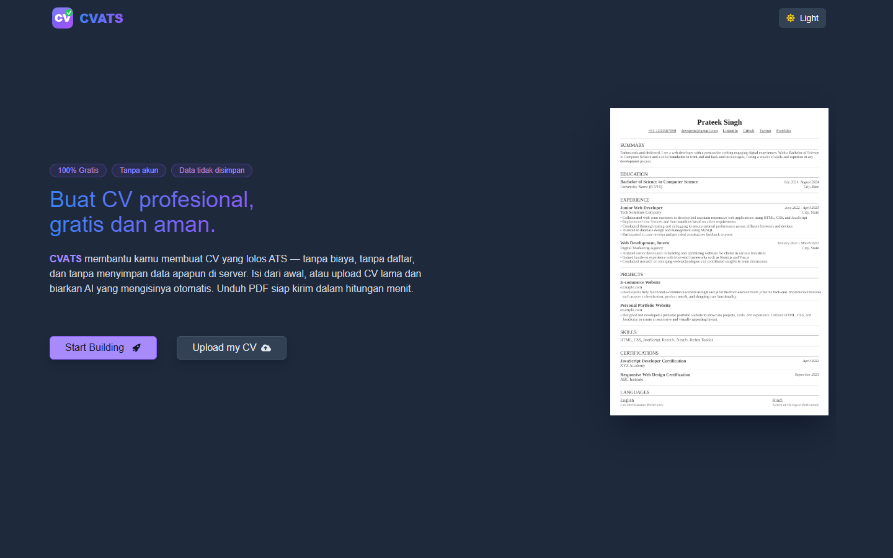
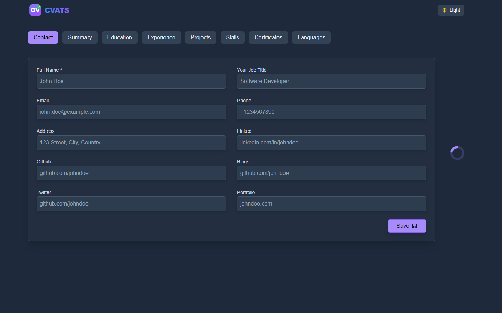

<div align="center">
  
  <h1>CVATS</h1>
  <p><strong>Build a professional CV, free and secure.</strong></p>
  <p>AI-powered resume builder — no cost, no account, no data stored on our servers.</p>
</div>

---

## ✨ Features

| Feature | Description |
|---|---|
| **100% Free** | All features available at no cost |
| **No Account** | No sign-up or login required |
| **Data Private** | Data lives in your browser only — nothing sent to the server |
| **AI CV Upload** | Upload an old PDF resume and AI fills all fields automatically |
| **AI Refine** | Polish your summary, experience, and projects with one click |
| **ATS Match Score** | Score your CV against a job posting — paste text, URL, or screenshot |
| **ATS-Friendly Format** | CV structure designed to pass Applicant Tracking Systems |
| **2 Templates** | Classic (traditional) and Modern (contemporary) |
| **Compact Mode** | One click to tighten the CV to fit a single page |
| **Skills as Tags** | Add skills one by one, displayed neatly as badges |
| **Dark / Light Mode** | Dark and light theme, preference saved automatically |
| **EN / ID Language** | Full bilingual UI — English and Bahasa Indonesia |
| **PDF Export** | Download your CV as an A4-ready PDF |

---

## 📸 Screenshots




---

## 🛠 Tech Stack

| Layer | Technology |
|---|---|
| **Framework** | Next.js 14 (App Router) |
| **Styling** | Tailwind CSS with dark mode |
| **State** | Redux Toolkit + localStorage persistence |
| **PDF Generate** | @react-pdf/renderer — Carlito font (Calibri equivalent) |
| **PDF Preview** | react-pdf |
| **AI** | OpenRouter — `google/gemma-4-31b-it:free` (fallback: Nemotron) |

---

## 🚀 Local Setup

1. Clone the repository:
   ```bash
   git clone https://github.com/CharisChakim/CVATS.git
   cd CVATS
   ```

2. Install dependencies:
   ```bash
   npm install
   ```

3. Create `.env.local` and add your OpenRouter API key:
   ```env
   OPENROUTER_API_KEY=your_key_here
   # Optional: override the default AI model
   # OPENROUTER_MODEL=google/gemma-4-31b-it:free
   ```

4. Start the dev server:
   ```bash
   npm run dev
   ```

5. Open `http://localhost:3000` in your browser.

---

## 📄 License

MIT License — free to use and modify.

---

<sub>Inspired by <a href="https://github.com/devxprite/resumave">Resumave</a> by <a href="https://github.com/devxprite">@devxprite</a>.</sub>
