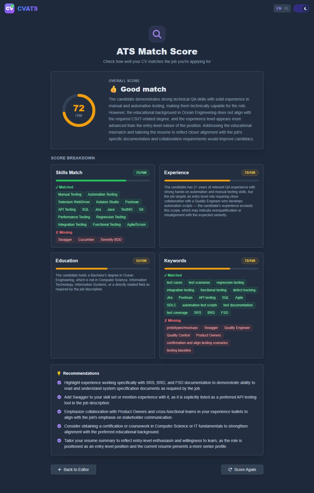

<div align="center">
  
  <h1>CVATS</h1>
  <p><strong>Build a professional CV, free and secure.</strong></p>
  <p>AI-powered resume builder — no cost, no account, no data stored on our servers.</p>
</div>

---

## ✨ Features

| Feature | Description |
|---|---|
| **100% Free** | All features available at no cost |
| **No Account** | No sign-up or login required |
| **Privacy First** | All data lives in your browser — nothing is stored on our servers |
| **AI CV Upload** | Upload an existing PDF resume and AI fills all fields automatically |
| **AI Refine** | Polish your summary, experience bullets, and project descriptions with one click |
| **ATS Match Score** | Score your CV against a job posting — paste text, URL, or screenshot |
| **ATS-Friendly Format** | CV structure designed to pass Applicant Tracking Systems |
| **2 Templates** | Classic (traditional) and Modern (contemporary) layouts |
| **Compact Mode** | One click to tighten the CV to a single page |
| **Skills as Tags** | Add and manage skills displayed as visual badges |
| **Dark / Light Mode** | Theme preference saved automatically |
| **EN / ID Language** | Full bilingual UI — English and Bahasa Indonesia |
| **PDF Export** | Download your CV as an A4-ready PDF |

---

## 📸 Screenshots


<br/><br/>

<br/><br/>


---

## 🛠 Tech Stack

| Layer | Technology |
|---|---|
| **Framework** | Next.js 14 (App Router) |
| **Styling** | Tailwind CSS + SCSS with dark mode |
| **State** | Redux Toolkit + localStorage persistence |
| **PDF Generate** | @react-pdf/renderer — Carlito font (Calibri equivalent) |
| **PDF Preview** | react-pdf |
| **AI Providers** | OpenRouter, Groq, Google AI Studio — free-tier models with automatic fallback |

---

## 🚀 Local Setup

1. Clone the repository:
   ```bash
   git clone https://github.com/CharisChakim/CVATS.git
   cd CVATS
   ```

2. Install dependencies:
   ```bash
   npm install
   ```

3. Create `.env.local` and configure your AI provider(s):
   ```env
   # OpenRouter — required (get key at openrouter.ai)
   OPENROUTER_API_KEY=your_key_here

   # Groq — optional fallback, 1,000 req/day free (console.groq.com)
   GROQ_API_KEY=your_key_here

   # Google AI Studio — optional fallback, 1,500 req/day free (aistudio.google.com)
   GEMINI_API_KEY=your_key_here

   # Optional: pin a specific OpenRouter model as the first choice
   # OPENROUTER_MODEL=openai/gpt-oss-120b:free
   ```
   At least one provider key is required. The app tries OpenRouter → Groq → Gemini automatically.

4. Start the dev server:
   ```bash
   npm run dev
   ```

5. Open `http://localhost:3000` in your browser.

---

## 📄 License

MIT License — free to use and modify.

---

<sub>Inspired by <a href="https://github.com/devxprite/resumave">Resumave</a> by <a href="https://github.com/devxprite">@devxprite</a>.</sub>
